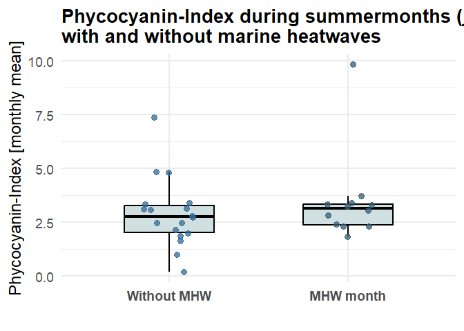
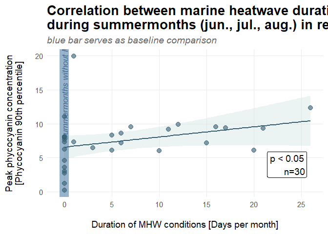
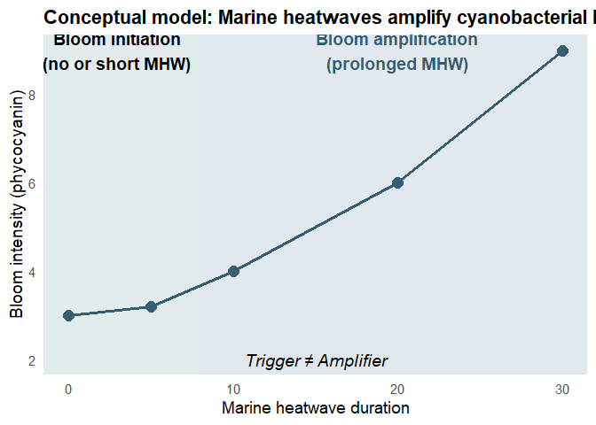

# EnviroChange: statistical analysis of MHW and HAB
Justin Lingg-Laham and Jonah van den Bos

# Introduction

EnviroChange: Marine Heatwaves – An overlooked driver of Baltic
cyanobacteria blooms? Part 3: Statistical analysis of marine heatwaves
and cyanobacterial bloom intensity

This R script works on the post-processing, MHW event detection, and
statistical analysis linking marine heatwaves (MHWs) to cyanobacterial
bloom intensity (HABs) in the Baltic Sea.

The primary goal is to assess whether MHWs act as a trigger or as an
amplifying factor for HABs during summer months (June–August) between
2015 and 2025.

Worksteps: 1. Load and filter phycocyanin bloom metrics (monthly
aggregates) (CSV from Code: Part. 1) 2. Load daily SST and
climatological threshold time series (CSV from Code: Part. 2) 3. Detect
marine heatwave events using the heatwaveR implementation (Hobday et
al. 2016). 4. Compare bloom intensity between months with and without
MHW occurrence (Boxplot) 5. Calculate correlation analyses between MHW
duration and bloom intensity (Scatterplot) 6. Generate figure for
Presentation and Understanding.

Key assumptions: - Key assumptions from Part 1 and 2 - Analysis is
restricted to summer months (June–August). - Marine heatwaves are
detected from surface SST only. - Focus is on bloom intensity.

# Preparation

To ensure Reproducibility, it is crucial to understand that when the
document is rendered, the working directory is automatically set to the
folder in which it is located. Therefore, it is necessary to maintain
the attached folder structure! The dataimport takes place via relative
paths to be independent from lokal storage pathways from different
Computersystems

``` r
getwd()
```

    [1] "C:/Users/justi/OneDrive/Desktop/UGM Semester 1/environmental_systems/EnviroChange/korrelation"

## Libraries

The following Libraries are used to provide access to additional
functions:

``` r
library(dplyr)      # Package to manipulate Data (filter, summarise, etc. )
library(tidyverse)  # Meta-package with more Functions (ggplot2 as example)
library(lubridate)  # Package to work with dates 
library(data.table) # Package to work with big datasets
library(heatwaveR)  # Package for work with MHW
library(ggplot2)    # Package to visualize data
```

# 1. Phycocyanin

Load monthly phycocyanin bloom metrics from Part. 1

``` r
phycocyanin <- read.csv("./data/S2_PC_monthly_JJA_2015_2025_roi_bottom.csv", sep = ",", header = TRUE)
phycocyanin
```

       system.index    PC_max   PC_mean PC_median     PC_p90 bloom_count_approx
    1             0        NA        NA        NA         NA         0.00000000
    2             1  15.07162 6.8207444 6.8207444  6.8207444         0.11680663
    3             2  67.79510 0.9853975 0.9667403  1.2713874         0.04805542
    4             3  28.42011 9.8468171 9.8468171  9.8888413         1.35470263
    5             4  49.20474 0.9970491 0.9970491  0.9970491         0.01085846
    6             5  59.38373 0.2007151 0.2007151  0.2245405         0.03368644
    7             6 166.84210 2.1381653 2.0870251  2.7431478         0.58236025
    8             7 176.35062 1.9805666 1.7509694  3.5922519         1.48825511
    9             8 182.44582 1.6540736 1.3771044  3.0311115         1.32774840
    10            9 162.69737 2.3000267 1.5886209  6.0941096         6.67178171
    11           10 185.00580 3.4066595 2.2124587  9.5333810        23.18316711
    12           11 219.99225 3.3942841 2.0924633  9.2183823        12.12833808
    13           12 177.08204 3.7094496 2.8160093  9.4185013        16.32002118
    14           13 224.01508 7.3794767 4.7323968 19.9322566        31.34167170
    15           14 183.11629 2.8149556 1.4587535  8.5862894         9.49164391
    16           15 160.38119 3.2328473 2.2722691  8.3215191         9.37507090
    17           16 149.77554 3.3344851 2.3338005  7.9612698        12.31103770
    18           17 231.81694 1.8454435 0.8724379  6.0193485         7.83661097
    19           18 161.35642 3.3248983 2.3808965  9.3413772        16.18715591
    20           19 216.94465 4.8478211 3.0852991 12.3232503        21.14309331
    21           20 285.63755 1.8731333 1.2356349  4.5832583         4.88793675
    22           21 226.14840 2.3964472 1.7383747  6.0862456         7.04197580
    23           22 169.09733 2.7913852 2.0362848  6.4639618         6.61022280
    24           23 227.12363 2.3180917 1.1425113  7.1924796        11.22485937
    25           24 155.68789 3.2921130 2.1637150  9.5377248        25.46404792
    26           25 194.94098 3.0775097 2.2587609  7.3376270         7.36712540
    27           26 158.61358 2.4657715 1.4892082  6.2201179         5.84454507
    28           27 222.30842 3.0367636 2.2632188  7.2009201         7.82046889
    29           28 191.77147 3.1515508 1.8253596  8.0769166        10.13780481
    30           29 174.40015 2.4686619 1.2403982  7.3534568        10.07538902
    31           30 153.24981 3.1152722 2.2650964  7.6704399        16.96754039
    32           31 306.36123 4.8242215 3.7066678 11.0244306        26.26894387
    33           32 220.84558 2.7156513 1.5283084  8.1243518        13.96436506
       bloom_fraction        end image_count month      start threshold_used year
    1              NA 2015-06-30           0     6 2015-06-01             10 2015
    2     0.116806627 2015-07-31           1     7 2015-07-01             10 2015
    3     0.003003463 2015-08-31          16     8 2015-08-01             10 2015
    4     0.451567545 2016-06-30           3     6 2016-06-01             10 2016
    5     0.010858461 2016-07-31           1     7 2016-07-01             10 2016
    6     0.005614407 2016-08-31           6     8 2016-08-01             10 2016
    7     0.011199236 2017-06-30          52     6 2017-06-01             10 2017
    8     0.016911990 2017-07-31          88     7 2017-07-01             10 2017
    9     0.017942546 2017-08-31          74     8 2017-08-01             10 2017
    10    0.032075874 2018-06-30         208     6 2018-06-01             10 2018
    11    0.084920026 2018-07-31         273     7 2018-07-01             10 2018
    12    0.086630986 2018-08-31         140     8 2018-08-01             10 2018
    13    0.069743680 2019-06-30         234     6 2019-06-01             10 2019
    14    0.197117432 2019-07-31         159     7 2019-07-01             10 2019
    15    0.056163573 2019-08-31         169     8 2019-08-01             10 2019
    16    0.051795972 2020-06-30         181     6 2020-06-01             10 2020
    17    0.079426050 2020-07-31         155     7 2020-07-01             10 2020
    18    0.034829382 2020-08-31         225     8 2020-08-01             10 2020
    19    0.065270790 2021-06-30         248     6 2021-06-01             10 2021
    20    0.138190152 2021-07-31         153     7 2021-07-01             10 2021
    21    0.039739323 2021-08-31         123     8 2021-08-01             10 2021
    22    0.036112696 2022-06-30         195     6 2022-06-01             10 2022
    23    0.047555560 2022-07-31         139     7 2022-07-01             10 2022
    24    0.055568611 2022-08-31         202     8 2022-08-01             10 2022
    25    0.107898508 2023-06-30         236     6 2023-06-01             10 2023
    26    0.062433266 2023-07-31         118     7 2023-07-01             10 2023
    27    0.067178679 2023-08-31          87     8 2023-08-01             10 2023
    28    0.060157453 2024-06-30         130     6 2024-06-01             10 2024
    29    0.077983114 2024-07-31         130     7 2024-07-01             10 2024
    30    0.059617687 2024-08-31         169     8 2024-08-01             10 2024
    31    0.079659814 2025-06-30         213     6 2025-06-01             10 2025
    32    0.165213483 2025-07-31         159     7 2025-07-01             10 2025
    33    0.066815144 2025-08-31         209     8 2025-08-01             10 2025
                                         .geo
    1  {"type":"MultiPoint","coordinates":[]}
    2  {"type":"MultiPoint","coordinates":[]}
    3  {"type":"MultiPoint","coordinates":[]}
    4  {"type":"MultiPoint","coordinates":[]}
    5  {"type":"MultiPoint","coordinates":[]}
    6  {"type":"MultiPoint","coordinates":[]}
    7  {"type":"MultiPoint","coordinates":[]}
    8  {"type":"MultiPoint","coordinates":[]}
    9  {"type":"MultiPoint","coordinates":[]}
    10 {"type":"MultiPoint","coordinates":[]}
    11 {"type":"MultiPoint","coordinates":[]}
    12 {"type":"MultiPoint","coordinates":[]}
    13 {"type":"MultiPoint","coordinates":[]}
    14 {"type":"MultiPoint","coordinates":[]}
    15 {"type":"MultiPoint","coordinates":[]}
    16 {"type":"MultiPoint","coordinates":[]}
    17 {"type":"MultiPoint","coordinates":[]}
    18 {"type":"MultiPoint","coordinates":[]}
    19 {"type":"MultiPoint","coordinates":[]}
    20 {"type":"MultiPoint","coordinates":[]}
    21 {"type":"MultiPoint","coordinates":[]}
    22 {"type":"MultiPoint","coordinates":[]}
    23 {"type":"MultiPoint","coordinates":[]}
    24 {"type":"MultiPoint","coordinates":[]}
    25 {"type":"MultiPoint","coordinates":[]}
    26 {"type":"MultiPoint","coordinates":[]}
    27 {"type":"MultiPoint","coordinates":[]}
    28 {"type":"MultiPoint","coordinates":[]}
    29 {"type":"MultiPoint","coordinates":[]}
    30 {"type":"MultiPoint","coordinates":[]}
    31 {"type":"MultiPoint","coordinates":[]}
    32 {"type":"MultiPoint","coordinates":[]}
    33 {"type":"MultiPoint","coordinates":[]}

## Phycocyanin-Filter

apply quality filtering to retain reliable bloom observations

``` r
pc_filt <- phycocyanin %>%
  filter(
    image_count >= 3,   # Keep only data with more then three Images per monthly Scene
    bloom_fraction > 0, # exclude months without detected bloom-signal
    !is.na(PC_mean),    # remove records with missing PC-statistics
    !is.na(PC_p90)
  )
pc_filt
```

       system.index    PC_max   PC_mean PC_median     PC_p90 bloom_count_approx
    1             2  67.79510 0.9853975 0.9667403  1.2713874         0.04805542
    2             3  28.42011 9.8468171 9.8468171  9.8888413         1.35470263
    3             5  59.38373 0.2007151 0.2007151  0.2245405         0.03368644
    4             6 166.84210 2.1381653 2.0870251  2.7431478         0.58236025
    5             7 176.35062 1.9805666 1.7509694  3.5922519         1.48825511
    6             8 182.44582 1.6540736 1.3771044  3.0311115         1.32774840
    7             9 162.69737 2.3000267 1.5886209  6.0941096         6.67178171
    8            10 185.00580 3.4066595 2.2124587  9.5333810        23.18316711
    9            11 219.99225 3.3942841 2.0924633  9.2183823        12.12833808
    10           12 177.08204 3.7094496 2.8160093  9.4185013        16.32002118
    11           13 224.01508 7.3794767 4.7323968 19.9322566        31.34167170
    12           14 183.11629 2.8149556 1.4587535  8.5862894         9.49164391
    13           15 160.38119 3.2328473 2.2722691  8.3215191         9.37507090
    14           16 149.77554 3.3344851 2.3338005  7.9612698        12.31103770
    15           17 231.81694 1.8454435 0.8724379  6.0193485         7.83661097
    16           18 161.35642 3.3248983 2.3808965  9.3413772        16.18715591
    17           19 216.94465 4.8478211 3.0852991 12.3232503        21.14309331
    18           20 285.63755 1.8731333 1.2356349  4.5832583         4.88793675
    19           21 226.14840 2.3964472 1.7383747  6.0862456         7.04197580
    20           22 169.09733 2.7913852 2.0362848  6.4639618         6.61022280
    21           23 227.12363 2.3180917 1.1425113  7.1924796        11.22485937
    22           24 155.68789 3.2921130 2.1637150  9.5377248        25.46404792
    23           25 194.94098 3.0775097 2.2587609  7.3376270         7.36712540
    24           26 158.61358 2.4657715 1.4892082  6.2201179         5.84454507
    25           27 222.30842 3.0367636 2.2632188  7.2009201         7.82046889
    26           28 191.77147 3.1515508 1.8253596  8.0769166        10.13780481
    27           29 174.40015 2.4686619 1.2403982  7.3534568        10.07538902
    28           30 153.24981 3.1152722 2.2650964  7.6704399        16.96754039
    29           31 306.36123 4.8242215 3.7066678 11.0244306        26.26894387
    30           32 220.84558 2.7156513 1.5283084  8.1243518        13.96436506
       bloom_fraction        end image_count month      start threshold_used year
    1     0.003003463 2015-08-31          16     8 2015-08-01             10 2015
    2     0.451567545 2016-06-30           3     6 2016-06-01             10 2016
    3     0.005614407 2016-08-31           6     8 2016-08-01             10 2016
    4     0.011199236 2017-06-30          52     6 2017-06-01             10 2017
    5     0.016911990 2017-07-31          88     7 2017-07-01             10 2017
    6     0.017942546 2017-08-31          74     8 2017-08-01             10 2017
    7     0.032075874 2018-06-30         208     6 2018-06-01             10 2018
    8     0.084920026 2018-07-31         273     7 2018-07-01             10 2018
    9     0.086630986 2018-08-31         140     8 2018-08-01             10 2018
    10    0.069743680 2019-06-30         234     6 2019-06-01             10 2019
    11    0.197117432 2019-07-31         159     7 2019-07-01             10 2019
    12    0.056163573 2019-08-31         169     8 2019-08-01             10 2019
    13    0.051795972 2020-06-30         181     6 2020-06-01             10 2020
    14    0.079426050 2020-07-31         155     7 2020-07-01             10 2020
    15    0.034829382 2020-08-31         225     8 2020-08-01             10 2020
    16    0.065270790 2021-06-30         248     6 2021-06-01             10 2021
    17    0.138190152 2021-07-31         153     7 2021-07-01             10 2021
    18    0.039739323 2021-08-31         123     8 2021-08-01             10 2021
    19    0.036112696 2022-06-30         195     6 2022-06-01             10 2022
    20    0.047555560 2022-07-31         139     7 2022-07-01             10 2022
    21    0.055568611 2022-08-31         202     8 2022-08-01             10 2022
    22    0.107898508 2023-06-30         236     6 2023-06-01             10 2023
    23    0.062433266 2023-07-31         118     7 2023-07-01             10 2023
    24    0.067178679 2023-08-31          87     8 2023-08-01             10 2023
    25    0.060157453 2024-06-30         130     6 2024-06-01             10 2024
    26    0.077983114 2024-07-31         130     7 2024-07-01             10 2024
    27    0.059617687 2024-08-31         169     8 2024-08-01             10 2024
    28    0.079659814 2025-06-30         213     6 2025-06-01             10 2025
    29    0.165213483 2025-07-31         159     7 2025-07-01             10 2025
    30    0.066815144 2025-08-31         209     8 2025-08-01             10 2025
                                         .geo
    1  {"type":"MultiPoint","coordinates":[]}
    2  {"type":"MultiPoint","coordinates":[]}
    3  {"type":"MultiPoint","coordinates":[]}
    4  {"type":"MultiPoint","coordinates":[]}
    5  {"type":"MultiPoint","coordinates":[]}
    6  {"type":"MultiPoint","coordinates":[]}
    7  {"type":"MultiPoint","coordinates":[]}
    8  {"type":"MultiPoint","coordinates":[]}
    9  {"type":"MultiPoint","coordinates":[]}
    10 {"type":"MultiPoint","coordinates":[]}
    11 {"type":"MultiPoint","coordinates":[]}
    12 {"type":"MultiPoint","coordinates":[]}
    13 {"type":"MultiPoint","coordinates":[]}
    14 {"type":"MultiPoint","coordinates":[]}
    15 {"type":"MultiPoint","coordinates":[]}
    16 {"type":"MultiPoint","coordinates":[]}
    17 {"type":"MultiPoint","coordinates":[]}
    18 {"type":"MultiPoint","coordinates":[]}
    19 {"type":"MultiPoint","coordinates":[]}
    20 {"type":"MultiPoint","coordinates":[]}
    21 {"type":"MultiPoint","coordinates":[]}
    22 {"type":"MultiPoint","coordinates":[]}
    23 {"type":"MultiPoint","coordinates":[]}
    24 {"type":"MultiPoint","coordinates":[]}
    25 {"type":"MultiPoint","coordinates":[]}
    26 {"type":"MultiPoint","coordinates":[]}
    27 {"type":"MultiPoint","coordinates":[]}
    28 {"type":"MultiPoint","coordinates":[]}
    29 {"type":"MultiPoint","coordinates":[]}
    30 {"type":"MultiPoint","coordinates":[]}

# 2. Marine Heatwave

Load daily SST and climatological threshold time series from Part. 2

``` r
mhw_daily <- read.csv("./data/Daily_SST_p90_JJA_2015_2025_roi_bottom.csv", sep = ",", header = TRUE)
mhw_daily
```

               date      sst threshold   region
    1    2015-06-01 10.57029  12.76826 roi_test
    2    2015-06-02 10.76332  13.76968 roi_test
    3    2015-06-03 10.79149  14.04454 roi_test
    4    2015-06-04 10.83213  14.28565 roi_test
    5    2015-06-05 11.28999  14.62623 roi_test
    6    2015-06-06 11.53679  14.71817 roi_test
    7    2015-06-07 11.52313  15.00673 roi_test
    8    2015-06-08 11.65123  15.41936 roi_test
    9    2015-06-09 12.05743  15.66662 roi_test
    10   2015-06-10 12.46481  15.70159 roi_test
    11   2015-06-11 12.66943  15.36478 roi_test
    12   2015-06-12 13.18687  15.25173 roi_test
    13   2015-06-13 13.71374  15.25291 roi_test
    14   2015-06-14 13.47055  15.17452 roi_test
    15   2015-06-15 12.93386  15.21297 roi_test
    16   2015-06-16 12.94030  15.23323 roi_test
    17   2015-06-17 13.12776  15.43408 roi_test
    18   2015-06-18 13.18609  15.73740 roi_test
    19   2015-06-19 13.38006  15.95161 roi_test
    20   2015-06-20 13.90737  16.42023 roi_test
    21   2015-06-21 14.39091  16.45319 roi_test
    22   2015-06-22 14.09534  16.24983 roi_test
    23   2015-06-23 13.85103  16.26379 roi_test
    24   2015-06-24 13.45620  16.52692 roi_test
    25   2015-06-25 13.45314  16.91373 roi_test
    26   2015-06-26 13.45584  17.20564 roi_test
    27   2015-06-27 14.00794  17.31350 roi_test
    28   2015-06-28 14.74014  17.31756 roi_test
    29   2015-06-29 15.01195  17.47916 roi_test
    30   2015-06-30 15.46092  17.76108 roi_test
    31   2015-07-01 16.04318  17.71990 roi_test
    32   2015-07-02 16.45869  17.69242 roi_test
    33   2015-07-03 16.91958  17.95916 roi_test
    34   2015-07-04 18.00805  18.33087 roi_test
    35   2015-07-05 19.50021  18.61003 roi_test
    36   2015-07-06 17.20596  18.07571 roi_test
    37   2015-07-07 16.17858  18.08307 roi_test
    38   2015-07-08 16.20015  18.38044 roi_test
    39   2015-07-09 15.61687  18.65362 roi_test
    40   2015-07-10 14.87076  18.66806 roi_test
    41   2015-07-11 14.72338  18.89525 roi_test
    42   2015-07-12 14.91341  19.22033 roi_test
    43   2015-07-13 15.58222  19.43204 roi_test
    44   2015-07-14 15.88027  19.44622 roi_test
    45   2015-07-15 15.74077  19.47589 roi_test
    46   2015-07-16 15.74146  19.29044 roi_test
    47   2015-07-17 15.94865  19.32085 roi_test
    48   2015-07-18 16.16195  19.18307 roi_test
    49   2015-07-19 15.87322  19.47271 roi_test
    50   2015-07-20 15.84587  19.59002 roi_test
    51   2015-07-21 16.08250  19.78194 roi_test
    52   2015-07-22 16.30092  19.97223 roi_test
    53   2015-07-23 16.20462  20.20488 roi_test
    54   2015-07-24 16.36504  20.42791 roi_test
    55   2015-07-25 16.34432  20.60545 roi_test
    56   2015-07-26 15.95712  20.81225 roi_test
    57   2015-07-27 15.86306  21.09049 roi_test
    58   2015-07-28 15.73096  21.33836 roi_test
    59   2015-07-29 15.62581  21.51728 roi_test
    60   2015-07-30 15.57621  21.59374 roi_test
    61   2015-07-31 15.54674  21.39091 roi_test
    62   2015-08-01 15.66077  21.26917 roi_test
    63   2015-08-02 16.34015  21.14748 roi_test
    64   2015-08-03 16.81097  21.20183 roi_test
    65   2015-08-04 16.86686  21.33384 roi_test
    66   2015-08-05 17.06611  21.31862 roi_test
    67   2015-08-06 17.60100  21.09151 roi_test
    68   2015-08-07 18.14729  20.89485 roi_test
    69   2015-08-08 18.35679  20.88389 roi_test
    70   2015-08-09 18.10297  20.82986 roi_test
    71   2015-08-10 18.44526  20.79673 roi_test
    72   2015-08-11 18.88252  20.69191 roi_test
    73   2015-08-12 18.87867  20.48013 roi_test
    74   2015-08-13 18.63486  20.41377 roi_test
    75   2015-08-14 18.27750  20.22851 roi_test
    76   2015-08-15 18.13556  19.87446 roi_test
    77   2015-08-16 17.98323  20.05447 roi_test
    78   2015-08-17 17.75402  20.27481 roi_test
    79   2015-08-18 17.57071  20.39098 roi_test
    80   2015-08-19 17.46231  20.48369 roi_test
    81   2015-08-20 17.52005  20.42825 roi_test
    82   2015-08-21 17.68046  20.30761 roi_test
    83   2015-08-22 17.93049  20.32358 roi_test
    84   2015-08-23 17.98655  20.37051 roi_test
    85   2015-08-24 18.13558  20.18186 roi_test
    86   2015-08-25 18.17791  20.00606 roi_test
    87   2015-08-26 17.95887  19.86173 roi_test
    88   2015-08-27 17.82774  19.76512 roi_test
    89   2015-08-28 17.75984  19.64956 roi_test
    90   2015-08-29 17.84523  19.65449 roi_test
    91   2015-08-30 17.87189  19.62731 roi_test
    92   2015-08-31 18.04663  19.62900 roi_test
    93   2016-06-01 14.23792  13.76968 roi_test
    94   2016-06-02 14.51950  14.04454 roi_test
    95   2016-06-03 15.14565  14.28565 roi_test
    96   2016-06-04 15.67310  14.62623 roi_test
    97   2016-06-05 15.06713  14.71817 roi_test
    98   2016-06-06 14.64228  15.00673 roi_test
    99   2016-06-07 14.71286  15.41936 roi_test
    100  2016-06-08 14.72542  15.66662 roi_test
    101  2016-06-09 14.17793  15.70159 roi_test
    102  2016-06-10 13.78058  15.36478 roi_test
    103  2016-06-11 13.72457  15.25173 roi_test
    104  2016-06-12 14.02417  15.25291 roi_test
    105  2016-06-13 14.31858  15.17452 roi_test
    106  2016-06-14 14.07904  15.21297 roi_test
    107  2016-06-15 14.18734  15.23323 roi_test
    108  2016-06-16 14.60640  15.43408 roi_test
    109  2016-06-17 14.96012  15.73740 roi_test
    110  2016-06-18 14.08655  15.95161 roi_test
    111  2016-06-19 14.06806  16.42023 roi_test
    112  2016-06-20 14.27433  16.45319 roi_test
    113  2016-06-21 15.13274  16.24983 roi_test
    114  2016-06-22 15.50092  16.26379 roi_test
    115  2016-06-23 16.69634  16.52692 roi_test
    116  2016-06-24 17.22684  16.91373 roi_test
    117  2016-06-25 18.20085  17.20564 roi_test
    118  2016-06-26 17.69905  17.31350 roi_test
    119  2016-06-27 17.06383  17.31756 roi_test
    120  2016-06-28 17.53241  17.47916 roi_test
    121  2016-06-29 17.79154  17.76108 roi_test
    122  2016-06-30 17.94699  17.71990 roi_test
    123  2016-07-01 18.03297  17.69242 roi_test
    124  2016-07-02 18.09560  17.95916 roi_test
    125  2016-07-03 17.99333  18.33087 roi_test
    126  2016-07-04 17.77062  18.61003 roi_test
    127  2016-07-05 17.58920  18.07571 roi_test
    128  2016-07-06 16.90257  18.08307 roi_test
    129  2016-07-07 16.77058  18.38044 roi_test
    130  2016-07-08 16.85574  18.65362 roi_test
    131  2016-07-09 17.01140  18.66806 roi_test
    132  2016-07-10 17.21618  18.89525 roi_test
    133  2016-07-11 17.27632  19.22033 roi_test
    134  2016-07-12 17.25289  19.43204 roi_test
    135  2016-07-13 17.46638  19.44622 roi_test
    136  2016-07-14 17.29267  19.47589 roi_test
    137  2016-07-15 16.87467  19.29044 roi_test
    138  2016-07-16 16.75175  19.32085 roi_test
    139  2016-07-17 16.78258  19.18307 roi_test
    140  2016-07-18 17.09450  19.47271 roi_test
    141  2016-07-19 17.63505  19.59002 roi_test
    142  2016-07-20 18.16011  19.78194 roi_test
    143  2016-07-21 18.34994  19.97223 roi_test
    144  2016-07-22 18.64150  20.20488 roi_test
    145  2016-07-23 18.97721  20.42791 roi_test
    146  2016-07-24 19.79488  20.60545 roi_test
    147  2016-07-25 20.23350  20.81225 roi_test
    148  2016-07-26 20.45519  21.09049 roi_test
    149  2016-07-27 20.23720  21.33836 roi_test
    150  2016-07-28 20.15889  21.51728 roi_test
    151  2016-07-29 20.11665  21.59374 roi_test
    152  2016-07-30 20.09103  21.39091 roi_test
    153  2016-07-31 19.91928  21.26917 roi_test
    154  2016-08-01 19.71043  21.14748 roi_test
    155  2016-08-02 19.41910  21.20183 roi_test
    156  2016-08-03 19.32314  21.33384 roi_test
    157  2016-08-04 19.08370  21.31862 roi_test
    158  2016-08-05 19.06459  21.09151 roi_test
    159  2016-08-06 18.89646  20.89485 roi_test
    160  2016-08-07 18.79239  20.88389 roi_test
    161  2016-08-08 18.66466  20.82986 roi_test
    162  2016-08-09 18.17574  20.79673 roi_test
    163  2016-08-10 17.80055  20.69191 roi_test
    164  2016-08-11 17.61442  20.48013 roi_test
    165  2016-08-12 17.58788  20.41377 roi_test
    166  2016-08-13 17.56729  20.22851 roi_test
    167  2016-08-14 17.51622  19.87446 roi_test
    168  2016-08-15 17.60449  20.05447 roi_test
    169  2016-08-16 17.44987  20.27481 roi_test
    170  2016-08-17 17.34358  20.39098 roi_test
    171  2016-08-18 17.43425  20.48369 roi_test
    172  2016-08-19 17.56726  20.42825 roi_test
    173  2016-08-20 17.62862  20.30761 roi_test
    174  2016-08-21 17.91895  20.32358 roi_test
    175  2016-08-22 17.93897  20.37051 roi_test
    176  2016-08-23 18.17823  20.18186 roi_test
    177  2016-08-24 18.53451  20.00606 roi_test
    178  2016-08-25 18.62919  19.86173 roi_test
    179  2016-08-26 18.64306  19.76512 roi_test
    180  2016-08-27 18.64976  19.64956 roi_test
    181  2016-08-28 18.61517  19.65449 roi_test
    182  2016-08-29 18.03213  19.62731 roi_test
    183  2016-08-30 17.91743  19.62900 roi_test
    184  2016-08-31 18.00463  18.52194 roi_test
    185  2017-06-01 11.44526  12.76826 roi_test
    186  2017-06-02 11.55923  13.76968 roi_test
    187  2017-06-03 11.63696  14.04454 roi_test
    188  2017-06-04 11.82799  14.28565 roi_test
    189  2017-06-05 11.90323  14.62623 roi_test
    190  2017-06-06 12.06088  14.71817 roi_test
    191  2017-06-07 11.98757  15.00673 roi_test
    192  2017-06-08 11.99539  15.41936 roi_test
    193  2017-06-09 12.53766  15.66662 roi_test
    194  2017-06-10 12.84683  15.70159 roi_test
    195  2017-06-11 12.84149  15.36478 roi_test
    196  2017-06-12 12.75427  15.25173 roi_test
    197  2017-06-13 12.53286  15.25291 roi_test
    198  2017-06-14 12.70471  15.17452 roi_test
    199  2017-06-15 13.12754  15.21297 roi_test
    200  2017-06-16 13.39734  15.23323 roi_test
    201  2017-06-17 13.95350  15.43408 roi_test
    202  2017-06-18 14.19947  15.73740 roi_test
    203  2017-06-19 14.32397  15.95161 roi_test
    204  2017-06-20 14.46827  16.42023 roi_test
    205  2017-06-21 14.25197  16.45319 roi_test
    206  2017-06-22 14.20936  16.24983 roi_test
    207  2017-06-23 14.51812  16.26379 roi_test
    208  2017-06-24 14.57849  16.52692 roi_test
    209  2017-06-25 14.43351  16.91373 roi_test
    210  2017-06-26 14.32439  17.20564 roi_test
    211  2017-06-27 14.36164  17.31350 roi_test
    212  2017-06-28 14.71412  17.31756 roi_test
    213  2017-06-29 14.78326  17.47916 roi_test
    214  2017-06-30 14.58830  17.76108 roi_test
    215  2017-07-01 14.60381  17.71990 roi_test
    216  2017-07-02 14.57628  17.69242 roi_test
    217  2017-07-03 14.50585  17.95916 roi_test
    218  2017-07-04 14.52079  18.33087 roi_test
    219  2017-07-05 14.92411  18.61003 roi_test
    220  2017-07-06 15.29957  18.07571 roi_test
    221  2017-07-07 15.49966  18.08307 roi_test
    222  2017-07-08 15.74739  18.38044 roi_test
    223  2017-07-09 15.79608  18.65362 roi_test
    224  2017-07-10 15.85121  18.66806 roi_test
    225  2017-07-11 15.99437  18.89525 roi_test
    226  2017-07-12 16.00092  19.22033 roi_test
    227  2017-07-13 15.97097  19.43204 roi_test
    228  2017-07-14 16.20388  19.44622 roi_test
    229  2017-07-15 16.69840  19.47589 roi_test
    230  2017-07-16 16.73455  19.29044 roi_test
    231  2017-07-17 16.33658  19.32085 roi_test
    232  2017-07-18 16.38091  19.18307 roi_test
    233  2017-07-19 16.86990  19.47271 roi_test
    234  2017-07-20 16.94630  19.59002 roi_test
    235  2017-07-21 16.85884  19.78194 roi_test
    236  2017-07-22 16.90261  19.97223 roi_test
    237  2017-07-23 16.94767  20.20488 roi_test
    238  2017-07-24 16.97541  20.42791 roi_test
    239  2017-07-25 16.91763  20.60545 roi_test
    240  2017-07-26 16.91958  20.81225 roi_test
    241  2017-07-27 17.20218  21.09049 roi_test
    242  2017-07-28 17.18532  21.33836 roi_test
    243  2017-07-29 17.28185  21.51728 roi_test
    244  2017-07-30 17.57488  21.59374 roi_test
    245  2017-07-31 17.81911  21.39091 roi_test
    246  2017-08-01 18.00530  21.26917 roi_test
    247  2017-08-02 18.08735  21.14748 roi_test
    248  2017-08-03 17.95552  21.20183 roi_test
    249  2017-08-04 17.59754  21.33384 roi_test
    250  2017-08-05 17.40443  21.31862 roi_test
    251  2017-08-06 17.32167  21.09151 roi_test
    252  2017-08-07 17.44206  20.89485 roi_test
    253  2017-08-08 17.60516  20.88389 roi_test
    254  2017-08-09 17.81807  20.82986 roi_test
    255  2017-08-10 18.11287  20.79673 roi_test
    256  2017-08-11 18.24780  20.69191 roi_test
    257  2017-08-12 17.78099  20.48013 roi_test
    258  2017-08-13 17.60857  20.41377 roi_test
    259  2017-08-14 17.72641  20.22851 roi_test
    260  2017-08-15 17.88353  19.87446 roi_test
    261  2017-08-16 17.90213  20.05447 roi_test
    262  2017-08-17 17.94720  20.27481 roi_test
    263  2017-08-18 18.01753  20.39098 roi_test
    264  2017-08-19 17.97434  20.48369 roi_test
    265  2017-08-20 17.85166  20.42825 roi_test
    266  2017-08-21 17.79185  20.30761 roi_test
    267  2017-08-22 17.80321  20.32358 roi_test
    268  2017-08-23 17.86242  20.37051 roi_test
    269  2017-08-24 17.88065  20.18186 roi_test
    270  2017-08-25 17.82954  20.00606 roi_test
    271  2017-08-26 17.78044  19.86173 roi_test
    272  2017-08-27 17.80947  19.76512 roi_test
    273  2017-08-28 17.95898  19.64956 roi_test
    274  2017-08-29 18.18213  19.65449 roi_test
    275  2017-08-30 18.21263  19.62731 roi_test
    276  2017-08-31 18.07953  19.62900 roi_test
    277  2018-06-01 14.80637  12.76826 roi_test
    278  2018-06-02 15.66310  13.76968 roi_test
    279  2018-06-03 16.03754  14.04454 roi_test
    280  2018-06-04 15.83126  14.28565 roi_test
    281  2018-06-05 15.22176  14.62623 roi_test
    282  2018-06-06 14.96051  14.71817 roi_test
    283  2018-06-07 15.21778  15.00673 roi_test
    284  2018-06-08 15.84351  15.41936 roi_test
    285  2018-06-09 15.93733  15.66662 roi_test
    286  2018-06-10 16.33172  15.70159 roi_test
    287  2018-06-11 16.30828  15.36478 roi_test
    288  2018-06-12 15.98736  15.25173 roi_test
    289  2018-06-13 16.18159  15.25291 roi_test
    290  2018-06-14 16.50612  15.17452 roi_test
    291  2018-06-15 16.72116  15.21297 roi_test
    292  2018-06-16 17.20863  15.23323 roi_test
    293  2018-06-17 17.43025  15.43408 roi_test
    294  2018-06-18 17.17899  15.73740 roi_test
    295  2018-06-19 16.79174  15.95161 roi_test
    296  2018-06-20 16.66325  16.42023 roi_test
    297  2018-06-21 16.20331  16.45319 roi_test
    298  2018-06-22 15.34520  16.24983 roi_test
    299  2018-06-23 15.29519  16.26379 roi_test
    300  2018-06-24 15.49031  16.52692 roi_test
    301  2018-06-25 15.94849  16.91373 roi_test
    302  2018-06-26 16.18668  17.20564 roi_test
    303  2018-06-27 16.81715  17.31350 roi_test
    304  2018-06-28 17.31067  17.31756 roi_test
    305  2018-06-29 16.71311  17.47916 roi_test
    306  2018-06-30 16.42549  17.76108 roi_test
    307  2018-07-01 16.25561  17.71990 roi_test
    308  2018-07-02 16.27259  17.69242 roi_test
    309  2018-07-03 16.78710  17.95916 roi_test
    310  2018-07-04 17.06826  18.33087 roi_test
    311  2018-07-05 17.12351  18.61003 roi_test
    312  2018-07-06 17.17410  18.07571 roi_test
    313  2018-07-07 17.51969  18.08307 roi_test
    314  2018-07-08 17.80776  18.38044 roi_test
    315  2018-07-09 17.80950  18.65362 roi_test
    316  2018-07-10 17.89175  18.66806 roi_test
    317  2018-07-11 17.93022  18.89525 roi_test
    318  2018-07-12 18.07342  19.22033 roi_test
    319  2018-07-13 18.45637  19.43204 roi_test
    320  2018-07-14 18.70968  19.44622 roi_test
    321  2018-07-15 19.04861  19.47589 roi_test
    322  2018-07-16 19.37075  19.29044 roi_test
    323  2018-07-17 19.69031  19.32085 roi_test
    324  2018-07-18 19.65106  19.18307 roi_test
    325  2018-07-19 19.89493  19.47271 roi_test
    326  2018-07-20 20.00953  19.59002 roi_test
    327  2018-07-21 20.21556  19.78194 roi_test
    328  2018-07-22 20.61969  19.97223 roi_test
    329  2018-07-23 20.96609  20.20488 roi_test
    330  2018-07-24 21.52926  20.42791 roi_test
    331  2018-07-25 22.19095  20.60545 roi_test
    332  2018-07-26 22.40519  20.81225 roi_test
    333  2018-07-27 22.30510  21.09049 roi_test
    334  2018-07-28 22.21336  21.33836 roi_test
    335  2018-07-29 22.43156  21.51728 roi_test
    336  2018-07-30 23.02075  21.59374 roi_test
    337  2018-07-31 23.37605  21.39091 roi_test
    338  2018-08-01 23.61890  21.26917 roi_test
    339  2018-08-02 23.82103  21.14748 roi_test
    340  2018-08-03 23.69659  21.20183 roi_test
    341  2018-08-04 23.53449  21.33384 roi_test
    342  2018-08-05 22.65037  21.31862 roi_test
    343  2018-08-06 21.97704  21.09151 roi_test
    344  2018-08-07 21.91895  20.89485 roi_test
    345  2018-08-08 21.85576  20.88389 roi_test
    346  2018-08-09 22.09791  20.82986 roi_test
    347  2018-08-10 21.76946  20.79673 roi_test
    348  2018-08-11 20.90260  20.69191 roi_test
    349  2018-08-12 20.33709  20.48013 roi_test
    350  2018-08-13 19.53056  20.41377 roi_test
    351  2018-08-14 19.43951  20.22851 roi_test
    352  2018-08-15 19.54816  19.87446 roi_test
    353  2018-08-16 19.80181  20.05447 roi_test
    354  2018-08-17 19.80676  20.27481 roi_test
    355  2018-08-18 19.80051  20.39098 roi_test
    356  2018-08-19 19.71367  20.48369 roi_test
    357  2018-08-20 19.34619  20.42825 roi_test
    358  2018-08-21 19.42931  20.30761 roi_test
    359  2018-08-22 19.71605  20.32358 roi_test
    360  2018-08-23 19.77560  20.37051 roi_test
    361  2018-08-24 19.62801  20.18186 roi_test
    362  2018-08-25 19.07541  20.00606 roi_test
    363  2018-08-26 18.87924  19.86173 roi_test
    364  2018-08-27 18.67881  19.76512 roi_test
    365  2018-08-28 18.56182  19.64956 roi_test
    366  2018-08-29 18.75785  19.65449 roi_test
    367  2018-08-30 18.72677  19.62731 roi_test
    368  2018-08-31 18.41448  19.62900 roi_test
    369  2019-06-01 11.13029  12.76826 roi_test
    370  2019-06-02 11.24119  13.76968 roi_test
    371  2019-06-03 11.82129  14.04454 roi_test
    372  2019-06-04 12.98619  14.28565 roi_test
    373  2019-06-05 14.08419  14.62623 roi_test
    374  2019-06-06 14.28994  14.71817 roi_test
    375  2019-06-07 14.45255  15.00673 roi_test
    376  2019-06-08 14.60353  15.41936 roi_test
    377  2019-06-09 14.11465  15.66662 roi_test
    378  2019-06-10 14.08553  15.70159 roi_test
    379  2019-06-11 14.42059  15.36478 roi_test
    380  2019-06-12 14.58953  15.25173 roi_test
    381  2019-06-13 15.12826  15.25291 roi_test
    382  2019-06-14 15.19998  15.17452 roi_test
    383  2019-06-15 15.30718  15.21297 roi_test
    384  2019-06-16 15.27344  15.23323 roi_test
    385  2019-06-17 15.66076  15.43408 roi_test
    386  2019-06-18 16.20285  15.73740 roi_test
    387  2019-06-19 16.54179  15.95161 roi_test
    388  2019-06-20 17.08235  16.42023 roi_test
    389  2019-06-21 17.16050  16.45319 roi_test
    390  2019-06-22 16.88538  16.24983 roi_test
    391  2019-06-23 17.04208  16.26379 roi_test
    392  2019-06-24 17.15772  16.52692 roi_test
    393  2019-06-25 18.26148  16.91373 roi_test
    394  2019-06-26 18.40025  17.20564 roi_test
    395  2019-06-27 17.71758  17.31350 roi_test
    396  2019-06-28 17.69889  17.31756 roi_test
    397  2019-06-29 17.74803  17.47916 roi_test
    398  2019-06-30 18.02984  17.76108 roi_test
    399  2019-07-01 17.77142  17.71990 roi_test
    400  2019-07-02 17.04157  17.69242 roi_test
    401  2019-07-03 16.22257  17.95916 roi_test
    402  2019-07-04 15.72154  18.33087 roi_test
    403  2019-07-05 15.38544  18.61003 roi_test
    404  2019-07-06 15.31219  18.07571 roi_test
    405  2019-07-07 15.11594  18.08307 roi_test
    406  2019-07-08 14.99644  18.38044 roi_test
    407  2019-07-09 15.34055  18.65362 roi_test
    408  2019-07-10 15.49799  18.66806 roi_test
    409  2019-07-11 15.65475  18.89525 roi_test
    410  2019-07-12 16.16670  19.22033 roi_test
    411  2019-07-13 16.67247  19.43204 roi_test
    412  2019-07-14 16.77880  19.44622 roi_test
    413  2019-07-15 16.63015  19.47589 roi_test
    414  2019-07-16 16.22125  19.29044 roi_test
    415  2019-07-17 16.53244  19.32085 roi_test
    416  2019-07-18 17.11348  19.18307 roi_test
    417  2019-07-19 17.36979  19.47271 roi_test
    418  2019-07-20 17.43412  19.59002 roi_test
    419  2019-07-21 17.33003  19.78194 roi_test
    420  2019-07-22 17.14005  19.97223 roi_test
    421  2019-07-23 17.78379  20.20488 roi_test
    422  2019-07-24 18.55415  20.42791 roi_test
    423  2019-07-25 18.80266  20.60545 roi_test
    424  2019-07-26 18.81727  20.81225 roi_test
    425  2019-07-27 18.78848  21.09049 roi_test
    426  2019-07-28 18.80176  21.33836 roi_test
    427  2019-07-29 19.27442  21.51728 roi_test
    428  2019-07-30 19.03948  21.59374 roi_test
    429  2019-07-31 19.16917  21.39091 roi_test
    430  2019-08-01 19.02687  21.26917 roi_test
    431  2019-08-02 18.79885  21.14748 roi_test
    432  2019-08-03 19.07264  21.20183 roi_test
    433  2019-08-04 19.24583  21.33384 roi_test
    434  2019-08-05 19.40216  21.31862 roi_test
    435  2019-08-06 19.29365  21.09151 roi_test
    436  2019-08-07 19.07382  20.89485 roi_test
    437  2019-08-08 19.07030  20.88389 roi_test
    438  2019-08-09 18.99735  20.82986 roi_test
    439  2019-08-10 18.96575  20.79673 roi_test
    440  2019-08-11 18.86382  20.69191 roi_test
    441  2019-08-12 18.89239  20.48013 roi_test
    442  2019-08-13 18.74334  20.41377 roi_test
    443  2019-08-14 18.53836  20.22851 roi_test
    444  2019-08-15 18.57508  19.87446 roi_test
    445  2019-08-16 18.53148  20.05447 roi_test
    446  2019-08-17 18.59877  20.27481 roi_test
    447  2019-08-18 18.64690  20.39098 roi_test
    448  2019-08-19 18.63436  20.48369 roi_test
    449  2019-08-20 18.67362  20.42825 roi_test
    450  2019-08-21 18.65471  20.30761 roi_test
    451  2019-08-22 18.75230  20.32358 roi_test
    452  2019-08-23 19.22497  20.37051 roi_test
    453  2019-08-24 19.63232  20.18186 roi_test
    454  2019-08-25 19.79517  20.00606 roi_test
    455  2019-08-26 20.06512  19.86173 roi_test
    456  2019-08-27 20.28329  19.76512 roi_test
    457  2019-08-28 20.42442  19.64956 roi_test
    458  2019-08-29 20.41292  19.65449 roi_test
    459  2019-08-30 20.42926  19.62731 roi_test
    460  2019-08-31 20.67248  19.62900 roi_test
    461  2020-06-01 11.32652  13.76968 roi_test
    462  2020-06-02 11.68901  14.04454 roi_test
    463  2020-06-03 12.19442  14.28565 roi_test
    464  2020-06-04 12.23258  14.62623 roi_test
    465  2020-06-05 12.04574  14.71817 roi_test
    466  2020-06-06 11.57806  15.00673 roi_test
    467  2020-06-07 11.70354  15.41936 roi_test
    468  2020-06-08 13.08935  15.66662 roi_test
    469  2020-06-09 13.12269  15.70159 roi_test
    470  2020-06-10 13.31289  15.36478 roi_test
    471  2020-06-11 13.19892  15.25173 roi_test
    472  2020-06-12 13.19187  15.25291 roi_test
    473  2020-06-13 13.08084  15.17452 roi_test
    474  2020-06-14 13.07526  15.21297 roi_test
    475  2020-06-15 13.15726  15.23323 roi_test
    476  2020-06-16 14.62168  15.43408 roi_test
    477  2020-06-17 14.76216  15.73740 roi_test
    478  2020-06-18 14.65349  15.95161 roi_test
    479  2020-06-19 14.88280  16.42023 roi_test
    480  2020-06-20 15.04206  16.45319 roi_test
    481  2020-06-21 15.74709  16.24983 roi_test
    482  2020-06-22 15.99199  16.26379 roi_test
    483  2020-06-23 16.09024  16.52692 roi_test
    484  2020-06-24 16.74830  16.91373 roi_test
    485  2020-06-25 17.20343  17.20564 roi_test
    486  2020-06-26 17.89753  17.31350 roi_test
    487  2020-06-27 18.81885  17.31756 roi_test
    488  2020-06-28 19.78644  17.47916 roi_test
    489  2020-06-29 19.62689  17.76108 roi_test
    490  2020-06-30 18.07443  17.71990 roi_test
    491  2020-07-01 16.66752  17.69242 roi_test
    492  2020-07-02 16.85349  17.95916 roi_test
    493  2020-07-03 16.93393  18.33087 roi_test
    494  2020-07-04 16.94517  18.61003 roi_test
    495  2020-07-05 16.60036  18.07571 roi_test
    496  2020-07-06 16.41006  18.08307 roi_test
    497  2020-07-07 16.02493  18.38044 roi_test
    498  2020-07-08 15.82507  18.65362 roi_test
    499  2020-07-09 15.77085  18.66806 roi_test
    500  2020-07-10 15.60028  18.89525 roi_test
    501  2020-07-11 15.51733  19.22033 roi_test
    502  2020-07-12 15.50978  19.43204 roi_test
    503  2020-07-13 15.69724  19.44622 roi_test
    504  2020-07-14 15.99305  19.47589 roi_test
    505  2020-07-15 16.32638  19.29044 roi_test
    506  2020-07-16 16.92794  19.32085 roi_test
    507  2020-07-17 17.74051  19.18307 roi_test
    508  2020-07-18 18.42051  19.47271 roi_test
    509  2020-07-19 18.71595  19.59002 roi_test
    510  2020-07-20 18.63647  19.78194 roi_test
    511  2020-07-21 17.89502  19.97223 roi_test
    512  2020-07-22 17.09186  20.20488 roi_test
    513  2020-07-23 16.92931  20.42791 roi_test
    514  2020-07-24 16.91456  20.60545 roi_test
    515  2020-07-25 16.98713  20.81225 roi_test
    516  2020-07-26 17.19850  21.09049 roi_test
    517  2020-07-27 17.35640  21.33836 roi_test
    518  2020-07-28 17.67023  21.51728 roi_test
    519  2020-07-29 17.12393  21.59374 roi_test
    520  2020-07-30 16.89583  21.39091 roi_test
    521  2020-07-31 17.02345  21.26917 roi_test
    522  2020-08-01 17.13801  21.14748 roi_test
    523  2020-08-02 17.15819  21.20183 roi_test
    524  2020-08-03 17.09037  21.33384 roi_test
    525  2020-08-04 17.17159  21.31862 roi_test
    526  2020-08-05 17.51485  21.09151 roi_test
    527  2020-08-06 17.98436  20.89485 roi_test
    528  2020-08-07 18.43969  20.88389 roi_test
    529  2020-08-08 19.01909  20.82986 roi_test
    530  2020-08-09 19.69406  20.79673 roi_test
    531  2020-08-10 19.27490  20.69191 roi_test
    532  2020-08-11 18.87534  20.48013 roi_test
    533  2020-08-12 18.84905  20.41377 roi_test
    534  2020-08-13 19.15069  20.22851 roi_test
    535  2020-08-14 19.61471  19.87446 roi_test
    536  2020-08-15 20.22815  20.05447 roi_test
    537  2020-08-16 20.71391  20.27481 roi_test
    538  2020-08-17 20.84899  20.39098 roi_test
    539  2020-08-18 20.80215  20.48369 roi_test
    540  2020-08-19 20.69915  20.42825 roi_test
    541  2020-08-20 20.70746  20.30761 roi_test
    542  2020-08-21 20.57497  20.32358 roi_test
    543  2020-08-22 20.46241  20.37051 roi_test
    544  2020-08-23 20.19864  20.18186 roi_test
    545  2020-08-24 20.03710  20.00606 roi_test
    546  2020-08-25 19.81936  19.86173 roi_test
    547  2020-08-26 19.44943  19.76512 roi_test
    548  2020-08-27 19.11734  19.64956 roi_test
    549  2020-08-28 18.89653  19.65449 roi_test
    550  2020-08-29 18.81365  19.62731 roi_test
    551  2020-08-30 18.82161  19.62900 roi_test
    552  2020-08-31 18.44961  18.52194 roi_test
    553  2021-06-01 11.57285  12.76826 roi_test
    554  2021-06-02 12.09313  13.76968 roi_test
    555  2021-06-03 12.68696  14.04454 roi_test
    556  2021-06-04 13.35591  14.28565 roi_test
    557  2021-06-05 13.73913  14.62623 roi_test
    558  2021-06-06 14.71242  14.71817 roi_test
    559  2021-06-07 15.71312  15.00673 roi_test
    560  2021-06-08 15.87525  15.41936 roi_test
    561  2021-06-09 15.92856  15.66662 roi_test
    562  2021-06-10 16.15556  15.70159 roi_test
    563  2021-06-11 16.65060  15.36478 roi_test
    564  2021-06-12 15.71995  15.25173 roi_test
    565  2021-06-13 14.40117  15.25291 roi_test
    566  2021-06-14 14.52843  15.17452 roi_test
    567  2021-06-15 14.92420  15.21297 roi_test
    568  2021-06-16 15.57379  15.23323 roi_test
    569  2021-06-17 16.05430  15.43408 roi_test
    570  2021-06-18 16.79881  15.73740 roi_test
    571  2021-06-19 17.57369  15.95161 roi_test
    572  2021-06-20 18.17956  16.42023 roi_test
    573  2021-06-21 18.50979  16.45319 roi_test
    574  2021-06-22 18.78103  16.24983 roi_test
    575  2021-06-23 18.58439  16.26379 roi_test
    576  2021-06-24 18.59268  16.52692 roi_test
    577  2021-06-25 18.73041  16.91373 roi_test
    578  2021-06-26 18.86041  17.20564 roi_test
    579  2021-06-27 19.32281  17.31350 roi_test
    580  2021-06-28 19.79683  17.31756 roi_test
    581  2021-06-29 20.10460  17.47916 roi_test
    582  2021-06-30 20.17012  17.76108 roi_test
    583  2021-07-01 19.73875  17.71990 roi_test
    584  2021-07-02 19.72613  17.69242 roi_test
    585  2021-07-03 20.19254  17.95916 roi_test
    586  2021-07-04 20.42380  18.33087 roi_test
    587  2021-07-05 20.60445  18.61003 roi_test
    588  2021-07-06 20.72828  18.07571 roi_test
    589  2021-07-07 20.66579  18.08307 roi_test
    590  2021-07-08 20.46013  18.38044 roi_test
    591  2021-07-09 20.19867  18.65362 roi_test
    592  2021-07-10 19.70061  18.66806 roi_test
    593  2021-07-11 19.54994  18.89525 roi_test
    594  2021-07-12 19.72522  19.22033 roi_test
    595  2021-07-13 20.38263  19.43204 roi_test
    596  2021-07-14 20.77981  19.44622 roi_test
    597  2021-07-15 21.47070  19.47589 roi_test
    598  2021-07-16 21.88009  19.29044 roi_test
    599  2021-07-17 21.68272  19.32085 roi_test
    600  2021-07-18 21.39643  19.18307 roi_test
    601  2021-07-19 20.78789  19.47271 roi_test
    602  2021-07-20 20.64792  19.59002 roi_test
    603  2021-07-21 20.49679  19.78194 roi_test
    604  2021-07-22 20.47699  19.97223 roi_test
    605  2021-07-23 20.52469  20.20488 roi_test
    606  2021-07-24 20.59583  20.42791 roi_test
    607  2021-07-25 20.58990  20.60545 roi_test
    608  2021-07-26 20.99941  20.81225 roi_test
    609  2021-07-27 21.18272  21.09049 roi_test
    610  2021-07-28 21.15690  21.33836 roi_test
    611  2021-07-29 21.12936  21.51728 roi_test
    612  2021-07-30 20.83444  21.59374 roi_test
    613  2021-07-31 19.76450  21.39091 roi_test
    614  2021-08-01 19.14850  21.26917 roi_test
    615  2021-08-02 18.98109  21.14748 roi_test
    616  2021-08-03 18.90337  21.20183 roi_test
    617  2021-08-04 19.07324  21.33384 roi_test
    618  2021-08-05 19.11320  21.31862 roi_test
    619  2021-08-06 19.06274  21.09151 roi_test
    620  2021-08-07 18.88971  20.89485 roi_test
    621  2021-08-08 18.95444  20.88389 roi_test
    622  2021-08-09 18.92320  20.82986 roi_test
    623  2021-08-10 18.90293  20.79673 roi_test
    624  2021-08-11 19.08542  20.69191 roi_test
    625  2021-08-12 19.22101  20.48013 roi_test
    626  2021-08-13 19.26725  20.41377 roi_test
    627  2021-08-14 19.07958  20.22851 roi_test
    628  2021-08-15 18.98011  19.87446 roi_test
    629  2021-08-16 18.94142  20.05447 roi_test
    630  2021-08-17 18.63587  20.27481 roi_test
    631  2021-08-18 17.99480  20.39098 roi_test
    632  2021-08-19 17.28102  20.48369 roi_test
    633  2021-08-20 16.96208  20.42825 roi_test
    634  2021-08-21 16.96479  20.30761 roi_test
    635  2021-08-22 17.27869  20.32358 roi_test
    636  2021-08-23 17.41309  20.37051 roi_test
    637  2021-08-24 17.44446  20.18186 roi_test
    638  2021-08-25 17.37097  20.00606 roi_test
    639  2021-08-26 16.83565  19.86173 roi_test
    640  2021-08-27 16.73274  19.76512 roi_test
    641  2021-08-28 16.67981  19.64956 roi_test
    642  2021-08-29 16.90569  19.65449 roi_test
    643  2021-08-30 16.82424  19.62731 roi_test
    644  2021-08-31 16.73719  19.62900 roi_test
    645  2022-06-01 11.17407  12.76826 roi_test
    646  2022-06-02 11.28953  13.76968 roi_test
    647  2022-06-03 11.45567  14.04454 roi_test
    648  2022-06-04 11.84838  14.28565 roi_test
    649  2022-06-05 12.21720  14.62623 roi_test
    650  2022-06-06 12.41891  14.71817 roi_test
    651  2022-06-07 13.15994  15.00673 roi_test
    652  2022-06-08 13.68630  15.41936 roi_test
    653  2022-06-09 14.00916  15.66662 roi_test
    654  2022-06-10 14.22719  15.70159 roi_test
    655  2022-06-11 14.45227  15.36478 roi_test
    656  2022-06-12 14.49578  15.25173 roi_test
    657  2022-06-13 14.45644  15.25291 roi_test
    658  2022-06-14 14.20017  15.17452 roi_test
    659  2022-06-15 14.05784  15.21297 roi_test
    660  2022-06-16 14.29716  15.23323 roi_test
    661  2022-06-17 14.65948  15.43408 roi_test
    662  2022-06-18 14.78318  15.73740 roi_test
    663  2022-06-19 14.54641  15.95161 roi_test
    664  2022-06-20 14.51867  16.42023 roi_test
    665  2022-06-21 14.67916  16.45319 roi_test
    666  2022-06-22 14.98620  16.24983 roi_test
    667  2022-06-23 15.43481  16.26379 roi_test
    668  2022-06-24 15.93390  16.52692 roi_test
    669  2022-06-25 16.67643  16.91373 roi_test
    670  2022-06-26 17.49694  17.20564 roi_test
    671  2022-06-27 18.15184  17.31350 roi_test
    672  2022-06-28 18.26758  17.31756 roi_test
    673  2022-06-29 18.25835  17.47916 roi_test
    674  2022-06-30 18.38661  17.76108 roi_test
    675  2022-07-01 18.30834  17.71990 roi_test
    676  2022-07-02 18.06781  17.69242 roi_test
    677  2022-07-03 18.15937  17.95916 roi_test
    678  2022-07-04 18.03396  18.33087 roi_test
    679  2022-07-05 17.85256  18.61003 roi_test
    680  2022-07-06 17.69170  18.07571 roi_test
    681  2022-07-07 17.50932  18.08307 roi_test
    682  2022-07-08 17.36990  18.38044 roi_test
    683  2022-07-09 17.18965  18.65362 roi_test
    684  2022-07-10 17.10457  18.66806 roi_test
    685  2022-07-11 17.12107  18.89525 roi_test
    686  2022-07-12 17.28655  19.22033 roi_test
    687  2022-07-13 17.43341  19.43204 roi_test
    688  2022-07-14 17.23107  19.44622 roi_test
    689  2022-07-15 16.94682  19.47589 roi_test
    690  2022-07-16 16.72547  19.29044 roi_test
    691  2022-07-17 16.63552  19.32085 roi_test
    692  2022-07-18 16.78703  19.18307 roi_test
    693  2022-07-19 17.09872  19.47271 roi_test
    694  2022-07-20 17.50463  19.59002 roi_test
    695  2022-07-21 17.96411  19.78194 roi_test
    696  2022-07-22 18.16378  19.97223 roi_test
    697  2022-07-23 17.83146  20.20488 roi_test
    698  2022-07-24 17.51663  20.42791 roi_test
    699  2022-07-25 17.48113  20.60545 roi_test
    700  2022-07-26 17.38261  20.81225 roi_test
    701  2022-07-27 17.15646  21.09049 roi_test
    702  2022-07-28 16.93861  21.33836 roi_test
    703  2022-07-29 17.09633  21.51728 roi_test
    704  2022-07-30 17.27483  21.59374 roi_test
    705  2022-07-31 17.54113  21.39091 roi_test
    706  2022-08-01 17.81633  21.26917 roi_test
    707  2022-08-02 17.84953  21.14748 roi_test
    708  2022-08-03 18.31761  21.20183 roi_test
    709  2022-08-04 18.68963  21.33384 roi_test
    710  2022-08-05 18.76934  21.31862 roi_test
    711  2022-08-06 18.36810  21.09151 roi_test
    712  2022-08-07 18.08269  20.89485 roi_test
    713  2022-08-08 18.10259  20.88389 roi_test
    714  2022-08-09 18.35959  20.82986 roi_test
    715  2022-08-10 18.60887  20.79673 roi_test
    716  2022-08-11 18.95729  20.69191 roi_test
    717  2022-08-12 19.40475  20.48013 roi_test
    718  2022-08-13 19.74557  20.41377 roi_test
    719  2022-08-14 19.93839  20.22851 roi_test
    720  2022-08-15 20.14277  19.87446 roi_test
    721  2022-08-16 20.32776  20.05447 roi_test
    722  2022-08-17 20.63924  20.27481 roi_test
    723  2022-08-18 20.94979  20.39098 roi_test
    724  2022-08-19 21.01284  20.48369 roi_test
    725  2022-08-20 20.95575  20.42825 roi_test
    726  2022-08-21 20.65454  20.30761 roi_test
    727  2022-08-22 20.43896  20.32358 roi_test
    728  2022-08-23 20.34483  20.37051 roi_test
    729  2022-08-24 20.28852  20.18186 roi_test
    730  2022-08-25 20.18676  20.00606 roi_test
    731  2022-08-26 20.28438  19.86173 roi_test
    732  2022-08-27 20.50642  19.76512 roi_test
    733  2022-08-28 20.61906  19.64956 roi_test
    734  2022-08-29 20.35071  19.65449 roi_test
    735  2022-08-30 19.79375  19.62731 roi_test
    736  2022-08-31 19.46976  19.62900 roi_test
    737  2023-06-01 12.41251  12.76826 roi_test
    738  2023-06-02 12.14474  13.76968 roi_test
    739  2023-06-03 12.13717  14.04454 roi_test
    740  2023-06-04 12.39207  14.28565 roi_test
    741  2023-06-05 12.93373  14.62623 roi_test
    742  2023-06-06 13.56603  14.71817 roi_test
    743  2023-06-07 14.20257  15.00673 roi_test
    744  2023-06-08 14.60651  15.41936 roi_test
    745  2023-06-09 14.19209  15.66662 roi_test
    746  2023-06-10 13.65045  15.70159 roi_test
    747  2023-06-11 13.36257  15.36478 roi_test
    748  2023-06-12 13.41626  15.25173 roi_test
    749  2023-06-13 13.63324  15.25291 roi_test
    750  2023-06-14 13.81135  15.17452 roi_test
    751  2023-06-15 14.12698  15.21297 roi_test
    752  2023-06-16 14.64254  15.23323 roi_test
    753  2023-06-17 14.90024  15.43408 roi_test
    754  2023-06-18 15.25543  15.73740 roi_test
    755  2023-06-19 15.69617  15.95161 roi_test
    756  2023-06-20 15.92694  16.42023 roi_test
    757  2023-06-21 16.15927  16.45319 roi_test
    758  2023-06-22 16.34467  16.24983 roi_test
    759  2023-06-23 16.37755  16.26379 roi_test
    760  2023-06-24 16.75404  16.52692 roi_test
    761  2023-06-25 17.41546  16.91373 roi_test
    762  2023-06-26 17.81799  17.20564 roi_test
    763  2023-06-27 17.49928  17.31350 roi_test
    764  2023-06-28 17.39503  17.31756 roi_test
    765  2023-06-29 17.46212  17.47916 roi_test
    766  2023-06-30 17.49054  17.76108 roi_test
    767  2023-07-01 17.35401  17.71990 roi_test
    768  2023-07-02 17.05078  17.69242 roi_test
    769  2023-07-03 16.61101  17.95916 roi_test
    770  2023-07-04 16.12299  18.33087 roi_test
    771  2023-07-05 15.84863  18.61003 roi_test
    772  2023-07-06 15.78341  18.07571 roi_test
    773  2023-07-07 16.04148  18.08307 roi_test
    774  2023-07-08 16.53721  18.38044 roi_test
    775  2023-07-09 16.91594  18.65362 roi_test
    776  2023-07-10 17.26556  18.66806 roi_test
    777  2023-07-11 17.62835  18.89525 roi_test
    778  2023-07-12 17.47955  19.22033 roi_test
    779  2023-07-13 17.32449  19.43204 roi_test
    780  2023-07-14 17.21522  19.44622 roi_test
    781  2023-07-15 17.34729  19.47589 roi_test
    782  2023-07-16 17.57108  19.29044 roi_test
    783  2023-07-17 17.68827  19.32085 roi_test
    784  2023-07-18 17.50371  19.18307 roi_test
    785  2023-07-19 17.27996  19.47271 roi_test
    786  2023-07-20 17.06616  19.59002 roi_test
    787  2023-07-21 16.90259  19.78194 roi_test
    788  2023-07-22 16.86675  19.97223 roi_test
    789  2023-07-23 16.79890  20.20488 roi_test
    790  2023-07-24 16.93960  20.42791 roi_test
    791  2023-07-25 16.92733  20.60545 roi_test
    792  2023-07-26 17.00200  20.81225 roi_test
    793  2023-07-27 17.15276  21.09049 roi_test
    794  2023-07-28 17.45661  21.33836 roi_test
    795  2023-07-29 17.55501  21.51728 roi_test
    796  2023-07-30 17.71816  21.59374 roi_test
    797  2023-07-31 17.73896  21.39091 roi_test
    798  2023-08-01 17.69700  21.26917 roi_test
    799  2023-08-02 17.64107  21.14748 roi_test
    800  2023-08-03 17.70695  21.20183 roi_test
    801  2023-08-04 17.71660  21.33384 roi_test
    802  2023-08-05 17.69128  21.31862 roi_test
    803  2023-08-06 17.67579  21.09151 roi_test
    804  2023-08-07 17.16766  20.89485 roi_test
    805  2023-08-08 16.67088  20.88389 roi_test
    806  2023-08-09 16.19811  20.82986 roi_test
    807  2023-08-10 16.09119  20.79673 roi_test
    808  2023-08-11 16.03501  20.69191 roi_test
    809  2023-08-12 16.07468  20.48013 roi_test
    810  2023-08-13 16.10195  20.41377 roi_test
    811  2023-08-14 16.43369  20.22851 roi_test
    812  2023-08-15 16.92021  19.87446 roi_test
    813  2023-08-16 17.19087  20.05447 roi_test
    814  2023-08-17 17.24030  20.27481 roi_test
    815  2023-08-18 17.36039  20.39098 roi_test
    816  2023-08-19 17.60950  20.48369 roi_test
    817  2023-08-20 17.79960  20.42825 roi_test
    818  2023-08-21 17.88488  20.30761 roi_test
    819  2023-08-22 17.90380  20.32358 roi_test
    820  2023-08-23 17.95911  20.37051 roi_test
    821  2023-08-24 17.99557  20.18186 roi_test
    822  2023-08-25 18.11918  20.00606 roi_test
    823  2023-08-26 18.22017  19.86173 roi_test
    824  2023-08-27 18.11109  19.76512 roi_test
    825  2023-08-28 18.02132  19.64956 roi_test
    826  2023-08-29 17.92143  19.65449 roi_test
    827  2023-08-30 17.75743  19.62731 roi_test
    828  2023-08-31 17.68264  19.62900 roi_test
    829  2024-06-01 14.80801  13.76968 roi_test
    830  2024-06-02 15.15976  14.04454 roi_test
    831  2024-06-03 15.38678  14.28565 roi_test
    832  2024-06-04 15.32010  14.62623 roi_test
    833  2024-06-05 15.22218  14.71817 roi_test
    834  2024-06-06 15.03504  15.00673 roi_test
    835  2024-06-07 14.90359  15.41936 roi_test
    836  2024-06-08 14.81932  15.66662 roi_test
    837  2024-06-09 14.55830  15.70159 roi_test
    838  2024-06-10 14.04513  15.36478 roi_test
    839  2024-06-11 13.67273  15.25173 roi_test
    840  2024-06-12 13.46046  15.25291 roi_test
    841  2024-06-13 13.39790  15.17452 roi_test
    842  2024-06-14 13.48126  15.21297 roi_test
    843  2024-06-15 13.60157  15.23323 roi_test
    844  2024-06-16 13.94643  15.43408 roi_test
    845  2024-06-17 14.41679  15.73740 roi_test
    846  2024-06-18 14.64807  15.95161 roi_test
    847  2024-06-19 14.75343  16.42023 roi_test
    848  2024-06-20 14.67821  16.45319 roi_test
    849  2024-06-21 14.71710  16.24983 roi_test
    850  2024-06-22 14.81282  16.26379 roi_test
    851  2024-06-23 14.61619  16.52692 roi_test
    852  2024-06-24 14.96389  16.91373 roi_test
    853  2024-06-25 15.45686  17.20564 roi_test
    854  2024-06-26 16.05166  17.31350 roi_test
    855  2024-06-27 16.70882  17.31756 roi_test
    856  2024-06-28 17.04844  17.47916 roi_test
    857  2024-06-29 16.92984  17.76108 roi_test
    858  2024-06-30 16.70773  17.71990 roi_test
    859  2024-07-01 16.64458  17.69242 roi_test
    860  2024-07-02 16.57703  17.95916 roi_test
    861  2024-07-03 16.47399  18.33087 roi_test
    862  2024-07-04 16.24624  18.61003 roi_test
    863  2024-07-05 16.05083  18.07571 roi_test
    864  2024-07-06 15.84954  18.08307 roi_test
    865  2024-07-07 15.87661  18.38044 roi_test
    866  2024-07-08 16.32967  18.65362 roi_test
    867  2024-07-09 16.76185  18.66806 roi_test
    868  2024-07-10 17.48108  18.89525 roi_test
    869  2024-07-11 17.39770  19.22033 roi_test
    870  2024-07-12 17.46423  19.43204 roi_test
    871  2024-07-13 17.34413  19.44622 roi_test
    872  2024-07-14 17.17969  19.47589 roi_test
    873  2024-07-15 17.39987  19.29044 roi_test
    874  2024-07-16 17.51945  19.32085 roi_test
    875  2024-07-17 17.50168  19.18307 roi_test
    876  2024-07-18 17.43991  19.47271 roi_test
    877  2024-07-19 17.64319  19.59002 roi_test
    878  2024-07-20 18.21856  19.78194 roi_test
    879  2024-07-21 18.63612  19.97223 roi_test
    880  2024-07-22 18.61865  20.20488 roi_test
    881  2024-07-23 18.59157  20.42791 roi_test
    882  2024-07-24 18.64826  20.60545 roi_test
    883  2024-07-25 18.68172  20.81225 roi_test
    884  2024-07-26 18.74694  21.09049 roi_test
    885  2024-07-27 18.78747  21.33836 roi_test
    886  2024-07-28 18.64460  21.51728 roi_test
    887  2024-07-29 18.34951  21.59374 roi_test
    888  2024-07-30 18.31638  21.39091 roi_test
    889  2024-07-31 18.29346  21.26917 roi_test
    890  2024-08-01 18.35236  21.14748 roi_test
    891  2024-08-02 18.48440  21.20183 roi_test
    892  2024-08-03 18.67501  21.33384 roi_test
    893  2024-08-04 18.78661  21.31862 roi_test
    894  2024-08-05 19.02694  21.09151 roi_test
    895  2024-08-06 19.37652  20.89485 roi_test
    896  2024-08-07 19.63141  20.88389 roi_test
    897  2024-08-08 19.60103  20.82986 roi_test
    898  2024-08-09 19.30376  20.79673 roi_test
    899  2024-08-10 18.79988  20.69191 roi_test
    900  2024-08-11 18.32725  20.48013 roi_test
    901  2024-08-12 18.13639  20.41377 roi_test
    902  2024-08-13 18.28823  20.22851 roi_test
    903  2024-08-14 18.60568  19.87446 roi_test
    904  2024-08-15 18.78641  20.05447 roi_test
    905  2024-08-16 18.99932  20.27481 roi_test
    906  2024-08-17 19.18907  20.39098 roi_test
    907  2024-08-18 19.11401  20.48369 roi_test
    908  2024-08-19 19.14366  20.42825 roi_test
    909  2024-08-20 19.26801  20.30761 roi_test
    910  2024-08-21 19.19803  20.32358 roi_test
    911  2024-08-22 18.78702  20.37051 roi_test
    912  2024-08-23 18.51355  20.18186 roi_test
    913  2024-08-24 18.49702  20.00606 roi_test
    914  2024-08-25 18.40637  19.86173 roi_test
    915  2024-08-26 18.18212  19.76512 roi_test
    916  2024-08-27 18.22504  19.64956 roi_test
    917  2024-08-28 18.43622  19.65449 roi_test
    918  2024-08-29 18.61501  19.62731 roi_test
    919  2024-08-30 18.66524  19.62900 roi_test
    920  2024-08-31 18.56096  18.52194 roi_test
    921  2025-06-01 11.01274  12.76826 roi_test
    922  2025-06-02 11.32245  13.76968 roi_test
    923  2025-06-03 11.60631  14.04454 roi_test
    924  2025-06-04 11.92644  14.28565 roi_test
    925  2025-06-05 12.24066  14.62623 roi_test
    926  2025-06-06 12.35044  14.71817 roi_test
    927  2025-06-07 12.33979  15.00673 roi_test
    928  2025-06-08 12.21137  15.41936 roi_test
    929  2025-06-09 11.94677  15.66662 roi_test
    930  2025-06-10 11.87768  15.70159 roi_test
    931  2025-06-11 11.89130  15.36478 roi_test
    932  2025-06-12 12.14868  15.25173 roi_test
    933  2025-06-13 12.44166  15.25291 roi_test
    934  2025-06-14 12.87506  15.17452 roi_test
    935  2025-06-15 13.26785  15.21297 roi_test
    936  2025-06-16 13.31682  15.23323 roi_test
    937  2025-06-17 13.24821  15.43408 roi_test
    938  2025-06-18 13.27602  15.73740 roi_test
    939  2025-06-19 13.23309  15.95161 roi_test
    940  2025-06-20 13.36014  16.42023 roi_test
    941  2025-06-21 13.58344  16.45319 roi_test
    942  2025-06-22 13.80267  16.24983 roi_test
    943  2025-06-23 13.80259  16.26379 roi_test
    944  2025-06-24 13.67820  16.52692 roi_test
    945  2025-06-25 13.57335  16.91373 roi_test
    946  2025-06-26 13.66857  17.20564 roi_test
    947  2025-06-27 13.84138  17.31350 roi_test
    948  2025-06-28 13.98700  17.31756 roi_test
    949  2025-06-29 14.22387  17.47916 roi_test
    950  2025-06-30 14.45098  17.76108 roi_test
    951  2025-07-01 14.95926  17.71990 roi_test
    952  2025-07-02 15.50551  17.69242 roi_test
    953  2025-07-03 15.62227  17.95916 roi_test
    954  2025-07-04 15.46114  18.33087 roi_test
    955  2025-07-05 15.29218  18.61003 roi_test
    956  2025-07-06 15.23417  18.07571 roi_test
    957  2025-07-07 15.37418  18.08307 roi_test
    958  2025-07-08 15.57808  18.38044 roi_test
    959  2025-07-09 15.82959  18.65362 roi_test
    960  2025-07-10 16.08208  18.66806 roi_test
    961  2025-07-11 15.98445  18.89525 roi_test
    962  2025-07-12 15.69982  19.22033 roi_test
    963  2025-07-13 15.95226  19.43204 roi_test
    964  2025-07-14 16.46390  19.44622 roi_test
    965  2025-07-15 16.80367  19.47589 roi_test
    966  2025-07-16 17.00631  19.29044 roi_test
    967  2025-07-17 17.32070  19.32085 roi_test
    968  2025-07-18 17.81531  19.18307 roi_test
    969  2025-07-19 18.50346  19.47271 roi_test
    970  2025-07-20 19.05816  19.59002 roi_test
    971  2025-07-21 19.32548  19.78194 roi_test
    972  2025-07-22 19.27381  19.97223 roi_test
    973  2025-07-23 19.24816  20.20488 roi_test
    974  2025-07-24 19.39240  20.42791 roi_test
    975  2025-07-25 19.58597  20.60545 roi_test
    976  2025-07-26 19.67653  20.81225 roi_test
    977  2025-07-27 19.78888  21.09049 roi_test
    978  2025-07-28 19.77434  21.33836 roi_test
    979  2025-07-29 19.17376  21.51728 roi_test
    980  2025-07-30 18.95568  21.59374 roi_test
    981  2025-07-31 18.89371  21.39091 roi_test
    982  2025-08-01 18.94211  21.26917 roi_test
    983  2025-08-02 19.01624  21.14748 roi_test
    984  2025-08-03 18.98080  21.20183 roi_test
    985  2025-08-04 18.84189  21.33384 roi_test
    986  2025-08-05 18.61741  21.31862 roi_test
    987  2025-08-06 18.36975  21.09151 roi_test
    988  2025-08-07 18.09227  20.89485 roi_test
    989  2025-08-08 17.96611  20.88389 roi_test
    990  2025-08-09 18.04117  20.82986 roi_test
    991  2025-08-10 18.00137  20.79673 roi_test
    992  2025-08-11 17.95568  20.69191 roi_test
    993  2025-08-12 18.02899  20.48013 roi_test
    994  2025-08-13 18.42785  20.41377 roi_test
    995  2025-08-14 18.76350  20.22851 roi_test
    996  2025-08-15 18.95531  19.87446 roi_test
    997  2025-08-16 18.75424  20.05447 roi_test
    998  2025-08-17 18.59795  20.27481 roi_test
    999  2025-08-18 18.58782  20.39098 roi_test
    1000 2025-08-19 18.56205  20.48369 roi_test
    1001 2025-08-20 18.38593  20.42825 roi_test
    1002 2025-08-21 18.31032  20.30761 roi_test
    1003 2025-08-22 18.27362  20.32358 roi_test
    1004 2025-08-23 18.09796  20.37051 roi_test
    1005 2025-08-24 17.86253  20.18186 roi_test
    1006 2025-08-25 17.65426  20.00606 roi_test
    1007 2025-08-26 17.45245  19.86173 roi_test
    1008 2025-08-27 17.30955  19.76512 roi_test
    1009 2025-08-28 17.15383  19.64956 roi_test
    1010 2025-08-29 17.12608  19.65449 roi_test
    1011 2025-08-30 17.27592  19.62731 roi_test
    1012 2025-08-31 17.64552  19.62900 roi_test

# 3. MHW Detection (Hobday et al. 2016)

Marine Heatwave-detection using the Package: HeatwaveR

``` r
dat <- tibble(
  t    = as.Date(mhw_daily$date),       # Daily timestamps
  temp = mhw_daily$sst,                 # observed SST in °C
  seas = mhw_daily$threshold            # climatologic threshold (90th percentile)
)
dat <- dat %>%
  rename(thresh = seas) # rename treshold (to match heatwaveR naming convention)

dat <- dat %>%
  mutate(seas = thresh) #Duplicate threshold as seasonal climatology (required by                                detect_event)
colnames(dat) # check on Column-names
```

    [1] "t"      "temp"   "thresh" "seas"  

``` r
## Detect MHW events after Hobday et al. 2016 
## Definition: ≥ 5 consecutive days with SST exceeding the threshold
events <- detect_event(dat, minDuration = 5) 

event_table <- events$event # extract detected events
print(event_table)
```

       event_no index_start index_peak index_end duration date_start  date_peak
    1         1          93         96        97        5 2016-06-01 2016-06-04
    2         2         120        123       124        5 2016-06-28 2016-07-01
    3         3         277        277       296       20 2018-06-01 2018-06-01
    4         4         322        339       348       27 2018-07-16 2018-08-02
    5         5         382        393       399       18 2019-06-14 2019-06-25
    6         6         455        460       460        6 2019-08-26 2019-08-31
    7         7         486        488       490        5 2020-06-26 2020-06-28
    8         8         536        538       545       10 2020-08-15 2020-08-17
    9         9         559        563       564        6 2021-06-07 2021-06-11
    10       10         568        588       606       39 2021-06-16 2021-07-06
    11       11         670        672       677        8 2022-06-26 2022-06-28
    12       12         720        733       735       16 2022-08-15 2022-08-28
    13       13         758        762       764        7 2023-06-22 2023-06-26
    14       14         829        830       834        6 2024-06-01 2024-06-02
         date_end intensity_mean intensity_max intensity_var intensity_cumulative
    1  2016-06-05         0.6398        1.0469        0.2981               3.1990
    2  2016-07-02         0.1576        0.3406        0.1283               0.7878
    3  2018-06-20         1.0894        2.0381        0.6706              21.7880
    4  2018-08-11         1.1363        2.6735        0.7137              30.6810
    5  2019-07-01         0.4874        1.3478        0.3755               8.7732
    6  2019-08-31         0.6834        1.0435        0.2882               4.1003
    7  2020-06-30         1.3226        2.3073        0.8336               6.6129
    8  2020-08-24         0.2451        0.4580        0.1631               2.4511
    9  2021-06-12         0.6054        1.2858        0.3620               3.6322
    10 2021-07-24         1.6493        2.6526        0.7573              64.3220
    11 2022-07-03         0.5811        0.9500        0.2712               4.6484
    12 2022-08-30         0.3901        0.9695        0.2676               6.2416
    13 2023-06-28         0.2590        0.6123        0.2126               1.8131
    14 2024-06-06         0.7468        1.1152        0.4299               4.4809
       intensity_mean_relThresh intensity_max_relThresh intensity_var_relThresh
    1                    0.6398                  1.0469                  0.2981
    2                    0.1576                  0.3406                  0.1283
    3                    1.0894                  2.0381                  0.6706
    4                    1.1363                  2.6735                  0.7137
    5                    0.4874                  1.3478                  0.3755
    6                    0.6834                  1.0435                  0.2882
    7                    1.3226                  2.3073                  0.8336
    8                    0.2451                  0.4580                  0.1631
    9                    0.6054                  1.2858                  0.3620
    10                   1.6493                  2.6526                  0.7573
    11                   0.5811                  0.9500                  0.2712
    12                   0.3901                  0.9695                  0.2676
    13                   0.2590                  0.6123                  0.2126
    14                   0.7468                  1.1152                  0.4299
       intensity_cumulative_relThresh intensity_mean_abs intensity_max_abs
    1                          3.1990            14.9287           15.6731
    2                          0.7878            17.8799           18.0956
    3                         21.7880            16.1414           17.4302
    4                         30.6810            21.7679           23.8210
    5                          8.7732            16.9523           18.4002
    6                          4.1003            20.3812           20.6725
    7                          6.6129            18.8408           19.7864
    8                          2.4511            20.5273           20.8490
    9                          3.6322            16.0072           16.6506
    10                        64.3220            19.7044           21.8801
    11                         4.6484            18.1371           18.3866
    12                         6.2416            20.4685           21.0128
    13                         1.8131            17.0863           17.8180
    14                         4.4809            15.1553           15.3868
       intensity_var_abs intensity_cumulative_abs rate_onset rate_decline
    1             0.5624                  74.6433     0.4583       0.7031
    2             0.2253                  89.3995     0.1259       0.2941
    3             0.7424                 322.8283     3.5876       0.1047
    4             1.3507                 587.7332     0.1627       0.2779
    5             1.0440                 305.1415     0.1215       0.2534
    6             0.1998                 122.2875     0.1904       3.4866
    7             0.8645                  94.2041     0.8065       1.0570
    8             0.2829                 205.2729     0.2004       0.0618
    9             0.3546                  96.0430     0.2079       0.9851
    10            1.4330                 768.4700     0.1281       0.1393
    11            0.2774                 145.0968     0.3692       0.1815
    12            0.3276                 327.4961     0.0726       0.3864
    13            0.5877                 119.6040     0.1582       0.2329
    14            0.2099                  90.9319     1.0462       0.3020

``` r
## Derive annual marine heatwave characteristics
yearly <- event_table %>%
  mutate(year = year(date_start)) %>%
  group_by(year) %>%
  summarise(
    n_events = n(),                            # Number of MHW events per year
    mean_duration = mean(duration),            # Mean event duration (days)
    max_intensity = max(intensity_max),        # Max event intensity
    cum_intensity = sum(intensity_cumulative)  # cumulative annual intensity
  )

print(yearly) # used for statistics and visualization  
```

    # A tibble: 8 × 5
       year n_events mean_duration max_intensity cum_intensity
      <int>    <int>         <dbl>         <dbl>         <dbl>
    1  2016        2           5           1.05           3.99
    2  2018        2          23.5         2.67          52.5 
    3  2019        2          12           1.35          12.9 
    4  2020        2           7.5         2.31           9.06
    5  2021        2          22.5         2.65          68.0 
    6  2022        2          12           0.970         10.9 
    7  2023        1           7           0.612          1.81
    8  2024        1           6           1.12           4.48

# 4. Compare bloom intensity between months with and without MHW occurrence

The Goal is to test whether cyanobacterial bloom intensity differs
between summer months affected by marine heatwaves and those without
MHWs

``` r
# Aggregate marine heatwave characteristics to monthly scale
# (Each month is classified by total MHW duration and intensity)
mhw_monthly <- event_table %>%
  mutate(
    year  = year(date_start),  # Extract year from event start date
    month = month(date_start)  # Extract month from event start date
  ) %>%
  group_by(year, month) %>%
  summarise(
    mhw_days = sum(duration),  # Total number of MHW days per month
    cum_intensity = sum(intensity_cumulative), # Cumulative MHW intensity per month
    .groups = "drop"
  ) %>%
  # classify months based on presence of MHW conditions
  mutate(
    mhw_present = ifelse(mhw_days > 0, "MHW month", "Without MHW")
  )

# Combination: monthly MHW with phycocyanin bloom data
pc_mhw <- pc_filt %>%
  left_join(mhw_monthly, by = c("year", "month")) %>%
  # lable months without deteced MHW 
  mutate(
    mhw_present = ifelse(is.na(mhw_present), "Without MHW", mhw_present)
  )

# ## Set factor order for plotting (left: No MHW, right: MHW)
pc_mhw$mhw_present <- factor(
  pc_mhw$mhw_present,
  levels = c("Without MHW", "MHW month")
)

# Visualization: Boxplot comparison of phycocyanin index between MHW and non-MHW months with ggplot2

boxplot <- ggplot(pc_mhw, aes(x = mhw_present, y = PC_mean))+
  geom_boxplot(
    fill = "#d0e0e1", color = "black", outlier.shape = NA, width = 0.5) +
  
  geom_jitter( # jittered points to avoid overlaping Points
    aes(color = mhw_present), width = 0.15, size = 2.5, alpha = 0.75) +
  
  scale_color_manual(values = c( "Without MHW"   = "#346a96", "MHW month" = "#355e73")) +
  
  labs(x = "", y = "Phycocyanin-Index [monthly mean]", title = "Phycocyanin-Index during summermonths (jun., jul., aug.) in the Baltic Sea \nwith and without marine heatwaves") +
  
  theme_minimal(base_size = 18) +
  
  theme(legend.position = "none", plot.title = element_text(size = 20, face = "bold"), axis.text.x = element_text(face = "bold"))
print(boxplot)
```



``` r
ggsave(
  filename = "PC_Summer_MHW_500dpi.png", 
  plot = boxplot, 
  device = "png",
  width = 30,           
  height = 20,          
  units = "cm",         
  dpi = 500,            
  bg = "white"      
)
```

# 5. Correlation: MHW duration and bloom intensity

The goal is to test whether the intensity of cyanobacterial blooms
increases with the duration of marine heatwave conditions within a
month.

For correlation the Spearman rank correlation is used.

``` r
# Monatliche MHW Tage zählen
mhw_monthly_count <- dat %>%
  mutate(is_mhw = temp > thresh) %>%                  # Binary MHW condition per day
  group_by(year = year(t), month = month(t)) %>%      # Aggregate to monthly scale
  summarise(mhw_days = sum(is_mhw), .groups = "drop")# Total number of MHW days per month

# merge monthly MHW duration and filtered phycocyanin bloom metrics
analysis_final <- pc_filt %>%
  left_join(mhw_monthly_count, by = c("year", "month"))

# Correlation: This test evaluates whether longer MHW durations are associated with higher cyanobacterial bloom intensity (PC 90th percentile)
cor.test(analysis_final$mhw_days, analysis_final$PC_p90, method = "spearman")
```


        Spearman's rank correlation rho

    data:  analysis_final$mhw_days and analysis_final$PC_p90
    S = 2374.6, p-value = 0.008497
    alternative hypothesis: true rho is not equal to 0
    sample estimates:
          rho 
    0.4717251 

## Visualize Correlation

``` r
p_final <- ggplot(analysis_final, aes(x = mhw_days, y = PC_p90)) +
  annotate("text", x = 0, y = max(analysis_final$PC_p90, na.rm=TRUE) * 0.78, label = "Summermonths without MHW", angle = 90, color = "#4A6A8A", fontface = "italic", size = 4.5)  +

  geom_smooth(method = "lm", color = "#355e73", fill = "#d0e0e1", alpha = 0.4, linewidth = 1) + # Trendline
  annotate("rect", xmin = -0.5, xmax = 0.5, ymin = -Inf, ymax = Inf, fill = "#346a96", alpha = 0.5)+
  
  geom_point(color = "#355e73", size = 3, alpha = 0.6)+

  labs(title = "Correlation between marine heatwave duration and cyanobacterial bloom Intensity in the Baltic Sea \nduring summermonths (jun., jul., aug.) in research period (2015-2025)", 
    subtitle = "blue bar serves as baseline comparison",
    x = "Duration of MHW conditions [Days per month]",
    y = "Peak phycocyanin concentration\n[Phycocyanin 90th percentile]") +
  
  scale_x_continuous(breaks = seq(0, max(analysis_final$mhw_days, na.rm=TRUE), by = 5)) +

  theme_minimal(base_size = 14) +
  
  theme(plot.title = element_text(face = "bold", size = 20),
    plot.subtitle = element_text(color = "grey40", face = "italic"),
    panel.grid.minor = element_blank(),
    axis.title.y = element_text(margin = margin(r = 18)),
    axis.title.x = element_text(margin = margin(t = 18))
  )+
  annotate("label", x = max(analysis_final$mhw_days, na.rm =TRUE),y = min(analysis_final$PC_p90, na.rm = TRUE), label = "p < 0.05\nn=30", hjust = 1.1, vjust = -0.5, fill = "white", alpha = 0.9)

print(p_final)
```



``` r
ggsave(
  filename = "MHW_vs_AlgalIntensity.png",
  plot = p_final,
  width = 30,
  height = 20,
  units = "cm",
  dpi = 500,
  bg = "white"
)
```

# 6. Generate figure for Presentation and Understanding

``` r
library(ggplot2)

concept_data <- data.frame(
  mhw_days = c(0, 5, 10, 20, 30),
  bloom_intensity = c(3, 3.2, 4, 6, 9)
)

ggplot(concept_data, aes(x = mhw_days, y = bloom_intensity)) +
  annotate(
    "rect",
    xmin = -Inf, xmax = 8,
    ymin = -Inf, ymax = Inf,
    fill = "#d0e0e1", alpha = 0.6
  ) +
  annotate(
    "rect",
    xmin = 8, xmax = Inf,
    ymin = -Inf, ymax = Inf,
    fill = "#346a96", alpha = 0.15
  ) +
  geom_line(
    color = "#355e73",
    linewidth = 1.2
  ) +
  geom_point(
    size = 4,
    color = "#355e73"
  ) +
  annotate(
    "text",
    x = 3, y = 9,
    label = "Bloom initiation\n(no or short MHW)",
    size = 5,
    fontface = "bold"
  ) +
  annotate(
    "text",
    x = 20, y = 9,
    label = "Bloom amplification\n(prolonged MHW)",
    size = 5,
    fontface = "bold",
    color = "#355e73"
  ) +
  
  annotate(
    "text",
    x = 15, y = 2,
    label = "Trigger ≠ Amplifier",
    size = 5,
    fontface = "italic"
  ) +
  
  labs(
    title = "Conceptual model: Marine heatwaves amplify cyanobacterial blooms",
    x = "Marine heatwave duration",
    y = "Bloom intensity (phycocyanin)"
  ) +
  
  theme_minimal(base_size = 14) +
  theme(
    panel.grid = element_blank(),
    plot.title = element_text(face = "bold")
  )
```


